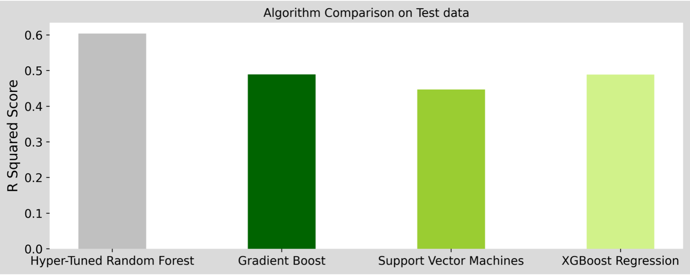

# Project Report: Predictive Price Modeling for Airbnb listings
A project based on ETL pipelines, ML workflow management and Monitoring

## Project Goals and Objectives

**The Problem:** Currently there is no convenient way for a new Airbnb host to decide the price of his or her listing. New hosts must often rely on the price of neighbouring listings when deciding on the price of their own listing.

**The Solution:** 
A Predictive Price Modelling tool whereby a new host can enter all the relevant details such as location of the listing, listing properties, available amenities etc. Futhermore, I'll build a solution to automate ml workflow, tracking parameter and gathering data to data warehouse.

## Project Overview

The project involved the following steps,

- *Exploratory Data Analysis:* Explore the various features, their distributions using Histograms and Box-plots
- *Pre-processing and Data Cleaning:* Normalisation, filling missing values, encoding categorical values, make data distribution more Gaussian
- *Feature Selection:* Study the correlation with response variable (Listing Price) and determine which features are most useful in predicting the price.
- *Model Training and Selection:* Training different models, tuning hyper-parameters and studying Model performance using Learning Curve.
- *Production:* Build ML Pipeline from notebook to large-scale system with Mlflow, Dagster, ... 
- *Container:* Using Docker to containerise the ML Pipeline


## Stack
We will be using the following tools in this project

- ML Pipeline: <a href="https://github.com/dagster-io/dagster"> Dagster </a>
- ML registry:  <a href="https://github.com/mlflow/mlflow"> MLflow </a>
- Artifact Storage:<a href="https://github.com/minio/minio"> MinIO </a>
- Data Warhouse: <a href="https://www.postgresql.org/"> PostgreSQL </a> and <a href="https://github.com/sosedoff/pgweb">pgweb</a> for sql queries

## How to run ??

**Poetry**
```
$ curl -sSL https://raw.githubusercontent.com/python-poetry/poetry/master/get-poetry.py | python -
$ poetry --version

## poetry to requirements.txt
$ poetry export -f requirements.txt --output requirements.txt
``` 
**Install all requirements package**

```
$ poetry install
$ pip install -r requirements.txt
```

**MLflow**
```
$ poetry shell
$ export MLFLOW_S3_ENDPOINT_URL=http://127.0.0.1:9000
$ export AWS_ACCESS_KEY_ID=minioadmin
$ export AWS_SECRET_ACCESS_KEY=minioadmin

# make sure that the backend store and artifact locations are same in the .env file as well
$ mlflow server \
    --backend-store-uri sqlite:///mlflow.db \
    --default-artifact-root s3://mlflow \
    --host 0.0.0.0
```

**Minio**
```
Follow the instructions here https://min.io/download#/linux

$ export MINIO_ROOT_USER=minioadmin
$ export MINIO_ROOT_PASSWORD=minioadmin

$ mkdir minio_data
$ minio server minio_data --console-address ":9001"
```
**Dagster**
```
$ poetry shell
$ dagit -f src/pipeline.py
```

**Postgres**
```
$ docker-compose -f docker-compose-postgres.yaml up
```
You should be able to view the UI at http://localhost:8081

## About Dataset

The Dataset used in this project was obtained from http://insideairbnb.com/get-the-data.html. There are a total of  records each of which contains details of one Airbnb listing from March to December 2021 with 56846 records

The dataset has a large number of features which can be categorised into following types,
- *Calendar data:* including listing id and the price and availability for that day
- *Reviews:* including unique id for each reviewer and detailed comments
- *Listings:* including full descriptions and average review score for each listing
    - *Location related:* Longitude, Latitude, Neighbourhood, Host Location
    - *Property related:* Property Type, Room Type, Accommodates, Bedrooms, Beds, Bed Type, Minimum Nights
    - *Booking Availability:* Availability 30, Availability 60, Availability 90, Availability 365
    - *Reviews related:* Number of Reviews, Reviews per Month, Review Scores Rating, Review Scores Accuracy, Review Scores Cleanliness, Review Scores Checkin, Review Scores Communication, Review Scores Location, Review Scores Value
    - *Host related:* Host Since, Host Response Time, Host Response Rate, Calculated host listings count, Host Since Days, Host Has Profile Pic, Host Identity Verified, Instant Bookable, Host Is Superhost
    - *Amenities:* TV, Wireless Internet, Kitchen, Heating, Family/kid friendly, Washer, Smoke detector, Fire extinguisher, Essentials, Cable TV, Internet, Dryer, First aid kit, Safety card, Shampoo, Hangers,...

The price of the listing will serve as labels for the regression task. The goal of this project would be to predict these price of the listings.

## EDA 
https://colab.research.google.com/drive/1x48-dPbLtU1PNj_1R0FXZsuTVNBdzLHa?usp=sharing

### *Question 1: how long have hosts been listing properties on Airbnb in Amsterdam?*


### *Question 2: what is the overall distribution of prices for ?*


### *Question 3: how have nightly prices changed over time?*


### *Question 4: what are the most common property and room types?*


### *Question 5: what is the distribution of reviews like?*


### *Question 6: Search factors affecting the rise in prices*

https://colab.research.google.com/drive/1k7y9nCmf-5bMBWUeCt-et_-RGFVf_Wpy?usp=sharing

<br>

<br>

<br>


## Data Warehouse for Analysis


**Query data after ETL from csv file to sql**


## Machine Learning Pipeline
**Dagster**


**Mlflow**


**MinIO**

